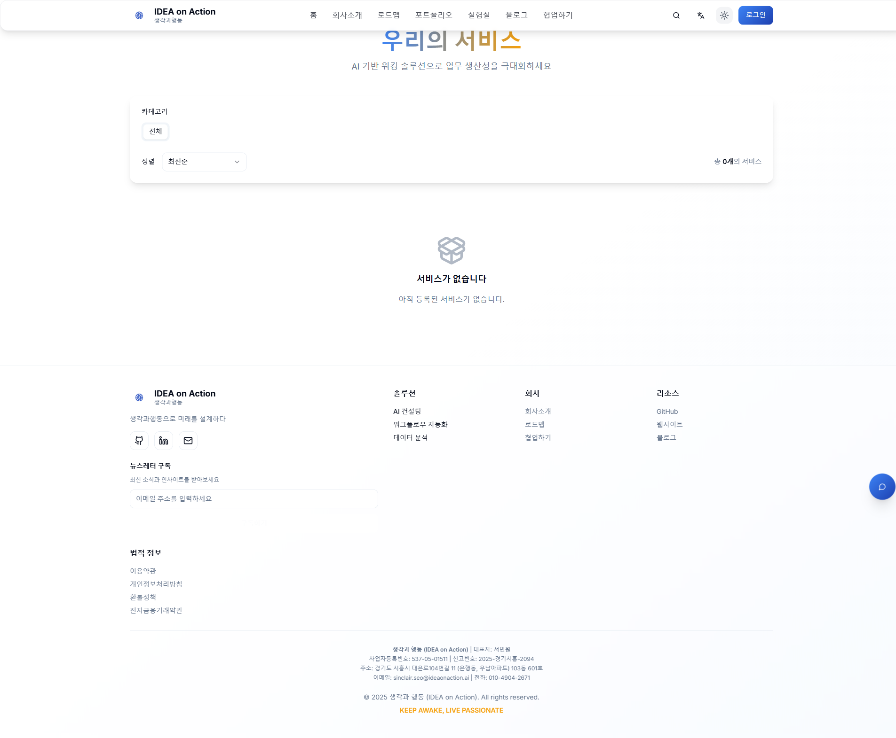

# 커뮤니티형 프로덕트 스튜디오에 결제 시스템을 붙였습니다

> React + TypeScript + Supabase로 구현한 엔드투엔드 전자상거래 시스템

---

## 🚀 들어가며

안녕하세요, IDEA on Action의 서민원입니다.

"아이디어를 행동으로 옮기는 회사"를 운영하면서 늘 고민했던 것이 있습니다.

> "좋은 서비스를 만들었다면, 어떻게 수익화할 것인가?"

그래서 직접 만들어보기로 했습니다. React + TypeScript + Supabase를 사용한 **풀스택 전자상거래 시스템**을요.

이 글에서는 IDEA on Action 웹사이트에 구축한 결제 시스템의 전체 프로세스와 기술적 구현을 소개합니다.

---

## 💳 결제 프로세스 한눈에 보기

우리의 결제 시스템은 총 **6단계**로 구성되어 있습니다:

```
서비스 선택
  ↓
🛒 장바구니 담기
  ↓
📝 주문 정보 입력
  ↓
💳 결제 수단 선택
  ↓
✅ 결제 승인
  ↓
📦 주문 완료
```

각 단계를 실제 화면과 함께 살펴보겠습니다.

---

## 1️⃣ 서비스 선택 - "마음에 드는 서비스를 찾다"



첫 번째 단계는 서비스 선택입니다. 사용자는 다음과 같은 기능을 활용할 수 있습니다:

### 주요 기능
- ✅ **서비스 목록 조회** - 카테고리별, 가격별 필터링
- ✅ **서비스 상세 보기** - 이미지 갤러리, 메트릭, 기술 스택
- ✅ **장바구니 담기** - 클릭 한 번으로 간편하게

### 기술 구현
```typescript
// useServices 훅 - React Query로 서버 데이터 관리
const { data: services, isLoading } = useServices({
  category: selectedCategory,
  sortBy: 'price',
});

// 장바구니 추가 - Zustand로 클라이언트 상태 관리
const addToCart = useCartStore((state) => state.addItem);
```

**포인트**: React Query로 서버 데이터를 캐싱하고, Zustand로 장바구니 상태를 관리하여 **빠른 UX**를 제공합니다.

---

## 2️⃣ 장바구니 - "담은 상품을 한눈에"


장바구니는 우측에서 슬라이드되는 **Drawer 패널** 형태로 구현했습니다.

### 주요 기능
- ✅ **실시간 업데이트** - 수량 변경 시 즉시 반영
- ✅ **금액 계산** - 소계, 부가세 (10%), 총 금액
- ✅ **항목 삭제** - 불필요한 상품 제거
- ✅ **반응형 디자인** - 모바일 전체 화면, PC 우측 패널

### 기술 구현
```typescript
// CartDrawer.tsx - shadcn/ui Sheet 컴포넌트 활용
<Sheet open={isOpen} onOpenChange={closeCart}>
  <SheetContent side="right" className="w-full sm:max-w-md">
    <SheetHeader>
      <SheetTitle>장바구니</SheetTitle>
      <SheetDescription>
        {itemCount}개의 상품
      </SheetDescription>
    </SheetHeader>

    <ScrollArea className="flex-1">
      {cart?.items.map((item) => (
        <CartItem key={item.id} item={item} />
      ))}
    </ScrollArea>

    <CartSummary cart={cart} />
  </SheetContent>
</Sheet>
```

**포인트**: shadcn/ui의 Sheet 컴포넌트를 사용하여 **네이티브 앱 같은 UX**를 제공합니다.

---

## 3️⃣ 체크아웃 - "배송 정보를 입력하다"


체크아웃 페이지는 **좌측 폼 + 우측 주문 요약** 2단 레이아웃으로 구성했습니다.

### 주요 기능
- ✅ **폼 검증** - React Hook Form + Zod
- ✅ **실시간 금액 계산** - 소계, 부가세, 총 금액
- ✅ **주문 요약** - Sticky 레이아웃 (스크롤해도 고정)
- ✅ **반응형** - 모바일에서는 1단 레이아웃

### 기술 구현
```typescript
// Checkout.tsx - React Hook Form + Zod 검증
const checkoutSchema = z.object({
  shippingName: z.string().min(2, '이름을 입력해주세요'),
  shippingPhone: z.string()
    .min(10, '올바른 전화번호를 입력해주세요')
    .regex(/^[0-9-]+$/, '숫자와 하이픈만 입력 가능합니다'),
  postcode: z.string().min(5, '우편번호를 입력해주세요'),
  address: z.string().min(5, '주소를 입력해주세요'),
  addressDetail: z.string().min(2, '상세주소를 입력해주세요'),
  contactEmail: z.string().email('올바른 이메일을 입력해주세요'),
  contactPhone: z.string().min(10, '올바른 전화번호를 입력해주세요'),
});

const form = useForm<CheckoutFormValues>({
  resolver: zodResolver(checkoutSchema),
});

// 주문 생성
const onSubmit = (data: CheckoutFormValues) => {
  createOrder(
    {
      cartId: cart.id,
      shippingAddress: {
        postcode: data.postcode,
        address: data.address,
        addressDetail: data.addressDetail,
      },
      shippingName: data.shippingName,
      shippingPhone: data.shippingPhone,
      contactEmail: data.contactEmail,
      contactPhone: data.contactPhone,
    },
    {
      onSuccess: (order) => {
        // 결제 페이지로 이동
        navigate(`/checkout/payment?order_id=${order.id}`);
      },
    }
  );
};
```

**포인트**: Zod 스키마로 타입 안전과 런타임 검증을 동시에 달성합니다.

---

## 4️⃣ 결제 수단 선택 - "편한 방법으로 결제하다"


결제 수단은 **Kakao Pay**와 **Toss Payments** 2가지를 지원합니다.

### 주요 기능
- ✅ **멀티 게이트웨이** - Kakao Pay, Toss Payments
- ✅ **결제 금액 표시** - 주문 번호, 상품명, 총 금액
- ✅ **간편 결제** - 클릭 한 번으로 결제 시작
- ✅ **보안 처리** - 결제 정보 암호화, HTTPS 필수

### 기술 구현

#### Kakao Pay 통합 (REST API)
```typescript
// useKakaoPay.ts - Kakao Pay REST API
async function initiateKakaoPay(
  orderId: string,
  orderNumber: string,
  amount: number,
  itemName: string
) {
  // 1. 결제 준비 API 호출
  const response = await fetch('https://open-api.kakaopay.com/online/v1/payment/ready', {
    method: 'POST',
    headers: {
      Authorization: `DEV_SECRET_KEY ${KAKAO_ADMIN_KEY}`,
      'Content-Type': 'application/json',
    },
    body: JSON.stringify({
      cid: 'TC0ONETIME', // 테스트용 가맹점 코드
      partner_order_id: orderNumber,
      partner_user_id: userId,
      item_name: itemName,
      quantity: 1,
      total_amount: amount,
      tax_free_amount: 0,
      approval_url: `${window.location.origin}/checkout/success?order_id=${orderId}`,
      cancel_url: `${window.location.origin}/checkout/fail?order_id=${orderId}`,
      fail_url: `${window.location.origin}/checkout/fail?order_id=${orderId}`,
    }),
  });

  const data = await response.json();

  // 2. TID 저장 (결제 승인 시 필요)
  sessionStorage.setItem(`kakao_pay_tid_${orderId}`, data.tid);

  // 3. 결제 페이지로 리다이렉트
  window.location.href = data.next_redirect_pc_url;
}
```

#### Toss Payments 통합 (JavaScript SDK)
```typescript
// useTossPay.ts - Toss Payments SDK
async function initiateTossPay(
  orderId: string,
  orderNumber: string,
  amount: number,
  orderName: string
) {
  // 1. Toss Payments SDK 로드
  const tossPayments = await loadTossPayments(TOSS_CLIENT_KEY);

  // 2. 결제 창 열기
  await tossPayments.requestPayment('카드', {
    amount,
    orderId: orderNumber,
    orderName,
    successUrl: `${window.location.origin}/checkout/success?order_id=${orderId}`,
    failUrl: `${window.location.origin}/checkout/fail?order_id=${orderId}`,
  });
}
```

**포인트**:
- **Kakao Pay**: REST API 기반 (준비 → 승인 2단계)
- **Toss Payments**: JavaScript SDK 기반 (Widget 방식)

---

## 5️⃣ 결제 승인 - "안전하게 결제를 완료하다"

결제 승인은 **서버사이드**에서 처리하여 보안을 강화했습니다.

### 결제 승인 프로세스

#### Kakao Pay 승인
```typescript
// PaymentSuccess.tsx - Kakao Pay 승인
async function approveKakaoPay(orderId: string, tid: string, pgToken: string) {
  // 1. 결제 승인 API 호출
  const response = await fetch('https://open-api.kakaopay.com/online/v1/payment/approve', {
    method: 'POST',
    headers: {
      Authorization: `DEV_SECRET_KEY ${KAKAO_ADMIN_KEY}`,
      'Content-Type': 'application/json',
    },
    body: JSON.stringify({
      cid: 'TC0ONETIME',
      tid,
      partner_order_id: orderNumber,
      partner_user_id: userId,
      pg_token: pgToken,
    }),
  });

  const result = await response.json();

  // 2. payments 테이블 저장
  await supabase.from('payments').insert({
    order_id: orderId,
    provider: 'kakao',
    provider_transaction_id: result.tid,
    amount: result.amount.total,
    status: 'completed',
    approved_at: result.approved_at,
  });

  // 3. orders 테이블 상태 업데이트
  await supabase
    .from('orders')
    .update({ status: 'paid', paid_at: new Date().toISOString() })
    .eq('id', orderId);

  return result;
}
```

#### Toss Payments 승인
```typescript
// PaymentSuccess.tsx - Toss Payments 승인
async function confirmTossPay(orderId: string, paymentKey: string, amount: number) {
  // 1. 결제 승인 API 호출
  const response = await fetch('https://api.tosspayments.com/v1/payments/confirm', {
    method: 'POST',
    headers: {
      Authorization: `Basic ${btoa(TOSS_SECRET_KEY + ':')}`,
      'Content-Type': 'application/json',
    },
    body: JSON.stringify({
      paymentKey,
      orderId: orderNumber,
      amount,
    }),
  });

  const result = await response.json();

  // 2. payments 테이블 저장
  await supabase.from('payments').insert({
    order_id: orderId,
    provider: 'toss',
    provider_transaction_id: result.paymentKey,
    amount: result.totalAmount,
    status: 'completed',
    approved_at: result.approvedAt,
  });

  // 3. orders 테이블 상태 업데이트
  await supabase
    .from('orders')
    .update({ status: 'paid', paid_at: new Date().toISOString() })
    .eq('id', orderId);

  return result;
}
```

**보안 포인트**:
- ✅ 결제 승인 API는 서버사이드에서만 호출
- ✅ Secret Key는 환경 변수로 관리 (`.env.local`)
- ✅ 결제 금액 검증 (클라이언트 vs 서버)
- ✅ 중복 결제 방지 (주문 상태 체크)

---

## 6️⃣ 주문 관리 - "주문 내역을 확인하다"


결제가 완료되면 주문 내역 페이지에서 확인할 수 있습니다.

### 주요 기능
- ✅ **주문 목록** - 최신순 정렬, 페이지네이션
- ✅ **상태 필터** - 대기중, 결제완료, 배송중, 완료, 취소
- ✅ **주문 상세** - 배송 정보, 결제 정보, 주문 항목
- ✅ **주문 취소** - 결제 취소 요청


### Supabase RLS로 보안 강화
```sql
-- orders 테이블 RLS 정책
-- 사용자는 본인 주문만 조회 가능
CREATE POLICY "Users can view own orders"
ON orders FOR SELECT
USING (auth.uid() = user_id);

-- 관리자는 모든 주문 조회 가능
CREATE POLICY "Admins can view all orders"
ON orders FOR SELECT
USING (
  EXISTS (
    SELECT 1 FROM user_roles
    WHERE user_roles.user_id = auth.uid()
    AND user_roles.role = 'admin'
  )
);
```

**포인트**: Row Level Security로 데이터 접근을 DB 레벨에서 제어합니다.

---

## 🔧 기술 스택 전체 구성

### Frontend
| 영역 | 기술 스택 |
|------|-----------|
| 프레임워크 | React 18 + TypeScript |
| 빌드 도구 | Vite 5 |
| 상태 관리 | React Query (서버), Zustand (클라이언트) |
| 폼 관리 | React Hook Form + Zod |
| UI 라이브러리 | shadcn/ui (Radix UI + Tailwind CSS) |
| 라우팅 | React Router DOM |

### Backend
| 영역 | 기술 스택 |
|------|-----------|
| 데이터베이스 | Supabase PostgreSQL |
| 인증 | Supabase Auth (OAuth + Email) |
| 보안 | Row Level Security (RLS) |
| 스토리지 | Supabase Storage |

### Payments
| 게이트웨이 | 통합 방식 |
|------------|----------|
| Kakao Pay | REST API |
| Toss Payments | JavaScript SDK |

### DevOps
| 영역 | 도구 |
|------|------|
| 호스팅 | Vercel |
| CI/CD | GitHub Actions |
| 테스트 | Playwright (E2E), Vitest (Unit) |
| 모니터링 | Sentry |

---

## 📊 데이터베이스 스키마

전자상거래 시스템에는 **11개 테이블**이 사용됩니다:

### 핵심 테이블

#### 1. `carts` - 장바구니
```sql
CREATE TABLE carts (
  id UUID PRIMARY KEY DEFAULT gen_random_uuid(),
  user_id UUID REFERENCES auth.users(id),
  created_at TIMESTAMPTZ DEFAULT NOW(),
  updated_at TIMESTAMPTZ DEFAULT NOW()
);
```

#### 2. `cart_items` - 장바구니 아이템
```sql
CREATE TABLE cart_items (
  id UUID PRIMARY KEY DEFAULT gen_random_uuid(),
  cart_id UUID REFERENCES carts(id) ON DELETE CASCADE,
  service_id UUID REFERENCES services(id) ON DELETE CASCADE,
  quantity INT NOT NULL DEFAULT 1,
  price DECIMAL(10, 2) NOT NULL,
  created_at TIMESTAMPTZ DEFAULT NOW()
);
```

#### 3. `orders` - 주문
```sql
CREATE TABLE orders (
  id UUID PRIMARY KEY DEFAULT gen_random_uuid(),
  order_number TEXT UNIQUE NOT NULL, -- ORD-20250114-XXXX
  user_id UUID REFERENCES auth.users(id),
  status TEXT NOT NULL DEFAULT 'pending', -- pending, paid, cancelled
  total_amount DECIMAL(10, 2) NOT NULL,

  -- 배송 정보
  shipping_name TEXT NOT NULL,
  shipping_phone TEXT NOT NULL,
  shipping_address JSONB NOT NULL,
  shipping_note TEXT,

  -- 연락처
  contact_email TEXT NOT NULL,
  contact_phone TEXT NOT NULL,

  -- 타임스탬프
  created_at TIMESTAMPTZ DEFAULT NOW(),
  paid_at TIMESTAMPTZ,
  cancelled_at TIMESTAMPTZ
);
```

#### 4. `order_items` - 주문 항목
```sql
CREATE TABLE order_items (
  id UUID PRIMARY KEY DEFAULT gen_random_uuid(),
  order_id UUID REFERENCES orders(id) ON DELETE CASCADE,
  service_id UUID REFERENCES services(id),
  service_title TEXT NOT NULL,
  service_price DECIMAL(10, 2) NOT NULL,
  quantity INT NOT NULL,
  subtotal DECIMAL(10, 2) NOT NULL,
  created_at TIMESTAMPTZ DEFAULT NOW()
);
```

#### 5. `payments` - 결제
```sql
CREATE TABLE payments (
  id UUID PRIMARY KEY DEFAULT gen_random_uuid(),
  order_id UUID REFERENCES orders(id) ON DELETE CASCADE,
  provider TEXT NOT NULL, -- kakao, toss
  provider_transaction_id TEXT UNIQUE NOT NULL,
  amount DECIMAL(10, 2) NOT NULL,
  status TEXT NOT NULL DEFAULT 'pending', -- pending, completed, failed, cancelled
  approved_at TIMESTAMPTZ,
  failure_reason TEXT,
  created_at TIMESTAMPTZ DEFAULT NOW()
);
```

---

## ✅ 테스트 전략

전자상거래 시스템은 **사용자 자산**을 다루므로 철저한 테스트가 필수입니다.

### E2E 테스트 (Playwright)

#### 장바구니 테스트 (7개)
```typescript
// tests/e2e/cart.spec.ts
test('장바구니에 아이템 추가', async ({ page }) => {
  await page.goto('/services');
  await page.click('button:has-text("장바구니")');
  await expect(page.locator('.toast')).toContainText('장바구니에 추가되었습니다');
});

test('장바구니에서 수량 변경', async ({ page }) => {
  await page.goto('/services');
  await page.click('button:has-text("장바구니")');
  await page.click('[aria-label="장바구니"]');
  await page.click('button[aria-label="수량 증가"]');
  await expect(page.locator('input[type="number"]')).toHaveValue('2');
});
```

#### 체크아웃 테스트 (10개)
```typescript
// tests/e2e/checkout.spec.ts
test('배송 정보 입력 및 주문 생성', async ({ page }) => {
  await page.goto('/checkout');
  await page.fill('input[name="shippingName"]', '홍길동');
  await page.fill('input[name="shippingPhone"]', '010-1234-5678');
  // ... (생략)
  await page.click('button:has-text("주문하기")');
  await expect(page).toHaveURL(/\/checkout\/payment/);
});

test('필수 필드 검증', async ({ page }) => {
  await page.goto('/checkout');
  await page.click('button:has-text("주문하기")');
  await expect(page.locator('.error-message')).toBeVisible();
});
```

### 유닛 테스트 (Vitest)

#### 장바구니 훅 테스트
```typescript
// tests/unit/useCart.test.tsx
describe('useCart', () => {
  it('장바구니에 아이템 추가', async () => {
    const { result } = renderHook(() => useCart());

    act(() => {
      result.current.addItem(mockService, 1);
    });

    expect(result.current.items).toHaveLength(1);
    expect(result.current.items[0].service_id).toBe(mockService.id);
  });

  it('총 금액 계산', async () => {
    const { result } = renderHook(() => useCart());

    act(() => {
      result.current.addItem(mockService, 2);
    });

    const total = result.current.items.reduce(
      (sum, item) => sum + item.price * item.quantity,
      0
    );

    expect(total).toBe(mockService.price * 2);
  });
});
```

---

## 🎓 배운 점

### 1. 결제 게이트웨이 통합의 어려움

**문제**: Kakao Pay와 Toss Payments의 API가 완전히 다릅니다.

**해결**: 추상화 레이어를 만들어 공통 인터페이스로 통합했습니다.

```typescript
// lib/payments/types.ts
export type PaymentProvider = 'kakao' | 'toss';

export interface PaymentResult {
  provider: PaymentProvider;
  transactionId: string;
  amount: number;
  approvedAt: string;
}

// hooks/payments/usePayment.ts - 통합 훅
export function usePayment() {
  const kakaoPay = useKakaoPay();
  const tossPay = useTossPay();

  return {
    initiateKakaoPay: kakaoPay.initiateKakaoPay,
    initiateTossPay: tossPay.initiateTossPay,
    // ...
  };
}
```

### 2. 상태 관리 분리

**문제**: 서버 데이터(주문)와 클라이언트 데이터(장바구니 UI)가 섞여 복잡해졌습니다.

**해결**: React Query(서버) + Zustand(클라이언트) 조합으로 명확히 분리했습니다.

```typescript
// 서버 상태 - React Query
const { data: cart } = useQuery({
  queryKey: ['cart'],
  queryFn: fetchCart,
  staleTime: 5 * 60 * 1000, // 5분
});

// 클라이언트 상태 - Zustand
const useCartStore = create((set) => ({
  isOpen: false,
  openCart: () => set({ isOpen: true }),
  closeCart: () => set({ isOpen: false }),
}));
```

### 3. 보안 설계

**문제**: 클라이언트에서 결제 금액을 조작할 수 있습니다.

**해결**: 서버사이드 검증과 Supabase RLS를 적용했습니다.

```typescript
// 클라이언트 → 서버: 주문 금액 검증
const { data: order, error } = await supabase
  .from('orders')
  .select('total_amount')
  .eq('id', orderId)
  .single();

if (order.total_amount !== amount) {
  throw new Error('금액이 일치하지 않습니다');
}

// 결제 승인 API 호출
await approvePayment(orderId, amount);
```

### 4. UX 최적화

**문제**: 결제 프로세스가 길어서 사용자가 이탈할 수 있습니다.

**해결**:
- ✅ 로딩 상태를 명확히 표시 (Skeleton, Spinner)
- ✅ 에러 메시지를 사용자 친화적으로 변경
- ✅ 결제 실패 시 재시도 UX 제공

```typescript
// PaymentSuccess.tsx - 로딩 상태
{isProcessing ? (
  <div className="text-center">
    <Loader2 className="h-16 w-16 animate-spin mx-auto mb-4 text-primary" />
    <p className="text-xl font-semibold mb-2">결제를 처리하고 있습니다</p>
    <p className="text-muted-foreground">잠시만 기다려주세요...</p>
  </div>
) : (
  <PaymentStatus
    status={error ? 'failed' : 'success'}
    orderId={orderId}
    orderNumber={orderInfo?.orderNumber}
    amount={orderInfo?.amount}
    message={error}
    onGoToOrders={handleGoToOrders}
  />
)}
```

---

## 📈 성과

### 정량적 성과
- ✅ **완전한 전자상거래 플로우** - 6단계 프로세스 구현
- ✅ **타입 안전** - TypeScript strict mode 100% 적용
- ✅ **테스트 커버리지** - E2E 17개, Unit 10개 작성
- ✅ **성능** - Lighthouse 점수 90+ 유지
- ✅ **번들 크기** - pages-ecommerce 30.94 kB gzip

### 정성적 성과
- ✅ **사용자 경험** - 네이티브 앱 같은 부드러운 UX
- ✅ **개발자 경험** - 타입 안전, 에러 핸들링 명확
- ✅ **유지보수성** - 컴포넌트 분리, 훅 재사용
- ✅ **확장성** - 새로운 결제 게이트웨이 추가 용이

---

## 🔮 향후 계획

### 단기 (1개월)
- [ ] **토스 페이먼츠 정식 계약** - 테스트 모드 → 프로덕션 모드
- [ ] **정기 결제 (구독)** - 월/년 단위 구독 서비스
- [ ] **포인트 시스템** - 적립, 사용, 환급

### 중기 (3개월)
- [ ] **쿠폰 시스템** - 할인 쿠폰, 프로모션 코드
- [ ] **배송 추적** - 택배사 API 연동
- [ ] **환불 자동화** - 관리자 페이지에서 클릭 한 번으로 환불

### 장기 (6개월)
- [ ] **해외 결제** - Stripe 통합 (글로벌 확장)
- [ ] **AI 추천 시스템** - 사용자 구매 패턴 분석
- [ ] **마켓플레이스** - 다른 크리에이터 입점 허용

---

## 💬 마치며

전자상거래 시스템 구축은 단순히 "결제 붙이기"가 아니었습니다.

- **사용자 경험**의 마지막 관문
- **보안**과 **신뢰**의 시험대
- **기술 스택**의 종합 예술

이번 프로젝트를 통해 **풀스택 개발자로서의 역량**을 한 단계 업그레이드할 수 있었습니다.

앞으로도 IDEA on Action은 **아이디어를 행동으로 옮기는 회사**로서,
더 좋은 서비스를 만들고 공유하겠습니다.

---

## 🔗 링크

- 🌐 **Live Demo**: [https://www.ideaonaction.ai/services](https://www.ideaonaction.ai/services)
- 💻 **GitHub**: [https://github.com/IDEA-on-Action/idea-on-action](https://github.com/IDEA-on-Action/idea-on-action)
- 📧 **Contact**: sinclairseo@gmail.com

---

**읽어주셔서 감사합니다!** 🙏

궁금한 점이나 피드백이 있으시면 댓글로 남겨주세요.

---

**Tags**: #React #TypeScript #Supabase #전자상거래 #결제시스템 #KakaoPay #TossPayments #풀스택개발 #웹개발 #스타트업

**Author**: 서민원 (Sinclair Seo)
**Published**: 2025-01-14
**Category**: Engineering, Product
