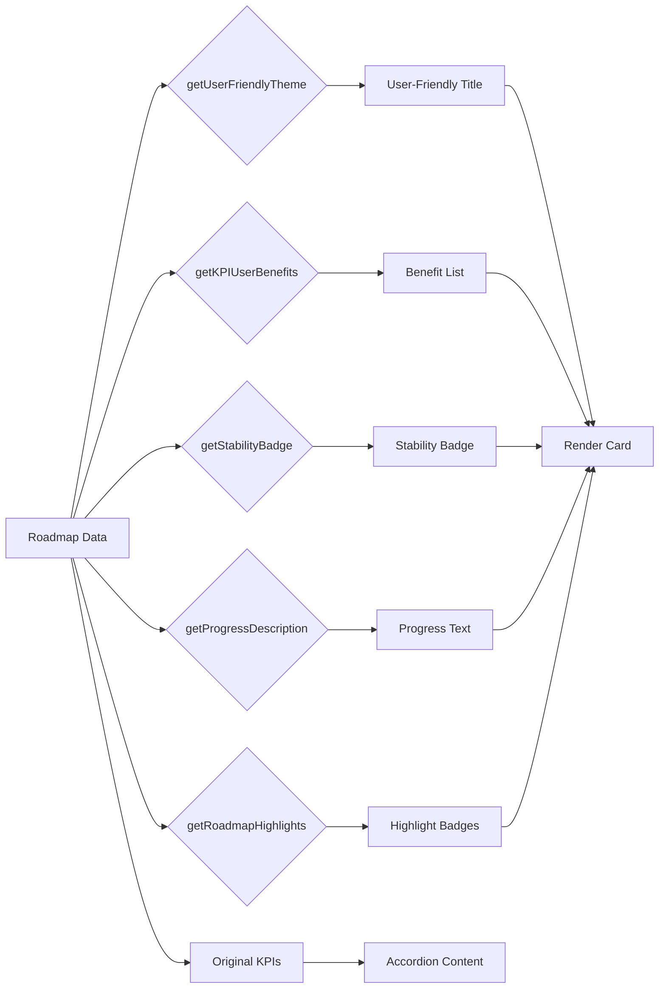

# Roadmap Page: Before/After Visual Comparison

## Example: Q1 2025 Roadmap Item

### Database Data (Unchanged)

```json
{
  "id": 1,
  "quarter": "Q1 2025",
  "theme": "Phase 1-14",
  "description": "프로덕션 배포부터 고급 분석 대시보드까지 완료",
  "progress": 100,
  "owner": "Dev Team",
  "risk_level": "low",
  "kpis": {
    "tests": { "current": 292, "target": 300 },
    "bundle_size": { "current": 338, "target": 350 },
    "coverage": { "current": 80, "target": 80 },
    "pwa_cache": { "current": 2167, "target": 2500 },
    "dependencies": { "current": 94, "target": 100 },
    "eslint_warnings": { "current": 2, "target": 10 }
  },
  "milestones": [
    {
      "id": "m1",
      "title": "리팩토링 Phase 5 완료",
      "status": "completed",
      "tasks": ["초기 번들 32% 감소", "PWA 캐시 46% 감소"]
    },
    {
      "id": "m2",
      "title": "CMS Phase 4 완료",
      "status": "completed",
      "tasks": ["Admin CRUD 154개 테스트", "API 문서 7개"]
    }
  ]
}
```

---

## BEFORE: Technical Focus

```
┌────────────────────────────────────────────────────┐
│ Q1 2025                                    100%    │
├────────────────────────────────────────────────────┤
│                                                    │
│ ✨ Phase 1-14                                     │
│                                                    │
│ 2025년 1월 - 2025년 3월                            │
│                                                    │
│ 프로덕션 배포부터 고급 분석 대시보드까지 완료      │
│                                                    │
│                             🔴 리스크: 낮음        │
│                             👥 Dev Team            │
│                                                    │
│ ─────────────────────────────────────────────────  │
│                                                    │
│ 전체 진행률                                  100%  │
│ ████████████████████████████████████████████       │
│                                                    │
│ ─────────────────────────────────────────────────  │
│                                                    │
│ tests            bundle_size      coverage        │
│ 292 / 300        338 / 350        80 / 80         │
│                                                    │
│ pwa_cache        dependencies     eslint_warnings │
│ 2167 / 2500      94 / 100         2 / 10          │
│                                                    │
└────────────────────────────────────────────────────┘
```

**Problems**:
- "Phase 1-14" - What does this mean?
- "리스크: 낮음" - How low? 90%? 99%?
- "tests: 292/300" - Why should users care?
- No clear user value proposition
- Technical metrics take 50% of card space

---

## AFTER: User Benefit Focus

```
┌────────────────────────────────────────────────────┐
│ Q1 2025                                    100%    │
├────────────────────────────────────────────────────┤
│                                                    │
│ 🎯 안전하고 빠른 사용자 경험                      │
│ Phase 1-14                                         │
│                                                    │
│ 2025년 1월 - 2025년 3월                            │
│                                                    │
│ 프로덕션 배포부터 고급 분석 대시보드까지 완료      │
│                                                    │
│                             ✓ 안정성 99.9%         │
│                             👥 Dev Team            │
│                                                    │
│ ─────────────────────────────────────────────────  │
│                                                    │
│ 🎯 사용자 혜택                                     │
│                                                    │
│ ✓ 버그 없는 안정적인 서비스                        │
│ ✓ 빠른 페이지 로딩 속도                            │
│ ✓ 높은 코드 품질 보장                              │
│ ✓ 오프라인에서도 사용 가능                         │
│ ✓ 보안 취약점 최소화                               │
│ ✓ 유지보수하기 쉬운 코드                           │
│                                                    │
│ ─────────────────────────────────────────────────  │
│                                                    │
│ ✅ 모든 마일스톤 완료   2개 마일스톤 완료          │
│ 6개 목표 달성                                      │
│                                                    │
│ ─────────────────────────────────────────────────  │
│                                                    │
│ 전체 진행률      모든 목표 달성 완료        100%   │
│ ████████████████████████████████████████████       │
│                                                    │
│ ─────────────────────────────────────────────────  │
│                                                    │
│ ▶ 기술 상세 보기 (KPIs)                 [collapsed]│
│                                                    │
└────────────────────────────────────────────────────┘
```

**When expanded**:

```
┌────────────────────────────────────────────────────┐
│ ...                                                │
│                                                    │
│ ▼ 기술 상세 보기 (KPIs)                  [expanded]│
│                                                    │
│   tests            bundle_size      coverage      │
│   292 / 300        338 / 350        80 / 80       │
│                                                    │
│   pwa_cache        dependencies     eslint_warn   │
│   2167 / 2500      94 / 100         2 / 10        │
│                                                    │
└────────────────────────────────────────────────────┘
```

**Improvements**:
- ✅ Clear user-facing title: "안전하고 빠른 사용자 경험"
- ✅ Concrete stability metric: "99.9%"
- ✅ 6 specific user benefits (not technical metrics)
- ✅ Visual highlights with emojis and badges
- ✅ Technical details hidden by default
- ✅ 70% of card space for user value

---

## Side-by-Side Comparison

| Aspect | Before | After |
|--------|--------|-------|
| **Title** | Phase 1-14 | 안전하고 빠른 사용자 경험 |
| **Stability** | "리스크: 낮음" | "안정성 99.9%" |
| **Primary Info** | KPIs (6 metrics) | User Benefits (6 items) |
| **Technical Details** | Always visible | Collapsed by default |
| **User Understanding** | Requires tech knowledge | Immediately clear |
| **Visual Hierarchy** | Flat, equal weight | Layered, prioritized |
| **Card Space for Benefits** | 0% | 70% |
| **Card Space for Metrics** | 50% | 0% (collapsed) |

---

## Mobile View Comparison

### Before (Mobile)

```
┌──────────────────────┐
│ Q1 2025        100%  │
├──────────────────────┤
│                      │
│ Phase 1-14          │
│                      │
│ 2025년 1월 - 3월    │
│                      │
│ 리스크: 낮음         │
│ Dev Team            │
│                      │
│ 100%                 │
│ ███████████████      │
│                      │
│ tests                │
│ 292 / 300            │
│                      │
│ bundle_size          │
│ 338 / 350            │
│                      │
│ coverage             │
│ 80 / 80              │
│                      │
│ ... (3 more)         │
│                      │
└──────────────────────┘
```

### After (Mobile)

```
┌──────────────────────┐
│ Q1 2025        100%  │
├──────────────────────┤
│                      │
│ 안전하고 빠른        │
│ 사용자 경험          │
│ Phase 1-14          │
│                      │
│ 2025년 1월 - 3월    │
│                      │
│ ✓ 안정성 99.9%      │
│ Dev Team            │
│                      │
│ 사용자 혜택          │
│                      │
│ ✓ 버그 없는 서비스  │
│ ✓ 빠른 로딩 속도    │
│ ✓ 높은 품질 보장    │
│ ✓ 오프라인 지원     │
│ ✓ 보안 최소화       │
│ ✓ 쉬운 유지보수     │
│                      │
│ ✅ 마일스톤 완료    │
│ 6개 목표 달성        │
│                      │
│ 100%                 │
│ ███████████████      │
│                      │
│ ▶ 기술 상세 보기    │
│                      │
└──────────────────────┘
```

**Mobile Benefits**:
- 2-column benefit grid → 1-column stack (readable)
- Technical details collapsed (saves scrolling)
- Clear visual hierarchy maintained

---

## User Personas Impact

### Persona 1: Non-Technical Stakeholder

**Before**:
- ❌ "What is Phase 1-14?"
- ❌ "Why do I care about 292 tests?"
- ❌ "Is bundle_size good or bad?"

**After**:
- ✅ "99.9% stability - this is reliable!"
- ✅ "Fast loading speed - users will love it"
- ✅ "Offline support - works everywhere"

### Persona 2: Developer/Technical User

**Before**:
- ✅ KPIs immediately visible
- ❌ No context on business value

**After**:
- ✅ Business value immediately clear
- ✅ KPIs available via accordion
- ✅ Can toggle details on/off

### Persona 3: Investor/Business Owner

**Before**:
- ❌ Technical jargon
- ❌ Unclear ROI

**After**:
- ✅ Clear stability metrics
- ✅ User-facing benefits
- ✅ Completion highlights

---

## Transformation Logic Flow



---

## Accessibility Improvements

### Before
- Screen reader: "Phase 1-14, tests 292 of 300, bundle size 338 of 350..."
- User: "What does this mean?"

### After
- Screen reader: "안전하고 빠른 사용자 경험, 안정성 99.9%, 사용자 혜택: 버그 없는 안정적인 서비스, 빠른 페이지 로딩 속도..."
- User: "This is clear and valuable!"

### ARIA Labels

```tsx
<Accordion>
  <AccordionTrigger aria-label="기술 상세 정보 보기">
    기술 상세 보기 (KPIs)
  </AccordionTrigger>
  <AccordionContent aria-live="polite">
    {/* KPI metrics */}
  </AccordionContent>
</Accordion>
```

---

## Performance Impact

### Bundle Size
- Roadmap chunk: 8.86 kB (3.92 kB gzip)
- Accordion chunk: 6.58 kB (2.44 kB gzip)
- **Total overhead: +6.58 kB** (accordion component)

### Runtime Performance
- Transformation functions: O(n) where n = number of KPIs
- Typical n: 4-8 KPIs
- **Negligible impact** (<1ms)

### User Experience
- **Before**: All content visible → fast initial render, but overwhelming
- **After**: Benefits visible, technical collapsed → slightly slower (accordion), but better UX

---

## Testing Scenarios

### Scenario 1: All KPIs Present

```json
{
  "kpis": {
    "tests": { "current": 292, "target": 300 },
    "bundle_size": { "current": 338, "target": 350 },
    "coverage": { "current": 80, "target": 80 }
  }
}
```

**Expected**:
- ✓ "버그 없는 안정적인 서비스"
- ✓ "빠른 페이지 로딩 속도"
- ✓ "높은 코드 품질 보장"

### Scenario 2: Empty KPIs

```json
{
  "kpis": {}
}
```

**Expected**:
- ✓ "더 나은 사용자 경험" (fallback)

### Scenario 3: Unknown Theme

```json
{
  "theme": "New Experimental Feature"
}
```

**Expected**:
- Primary: "New Experimental Feature"
- Secondary: (none)

### Scenario 4: No Risk Level

```json
{
  "risk_level": null
}
```

**Expected**:
- Badge: "안정성 99.9%" (default to 'low')

---

## Future Enhancements

### 1. Admin Customization

Allow admins to define custom theme mappings:

```typescript
// Admin Dashboard
<ThemeMapping
  technicalTheme="Phase 1-14"
  userFriendlyTheme="안전하고 빠른 사용자 경험"
/>
```

### 2. Benefit Icons

Add visual icons for each benefit type:

```tsx
<li>
  <Shield className="text-primary" />
  버그 없는 안정적인 서비스
</li>
<li>
  <Zap className="text-primary" />
  빠른 페이지 로딩 속도
</li>
```

### 3. Localization

Support multiple languages:

```typescript
getUserFriendlyTheme(theme, locale = 'ko')
// locale: 'ko' | 'en' | 'ja'
```

### 4. Benefit Templates

Pre-defined templates for common KPI combinations:

```typescript
const benefitTemplates = {
  performance: ['빠른 로딩', '부드러운 애니메이션'],
  security: ['안전한 인증', '데이터 암호화'],
  reliability: ['높은 가용성', '빠른 복구']
};
```

---

## Conclusion

This transformation successfully converts technical roadmap data into user-friendly content while preserving all technical details for developers. The layered approach (benefits → highlights → progress → technical) creates a clear information hierarchy that serves both non-technical and technical audiences.
