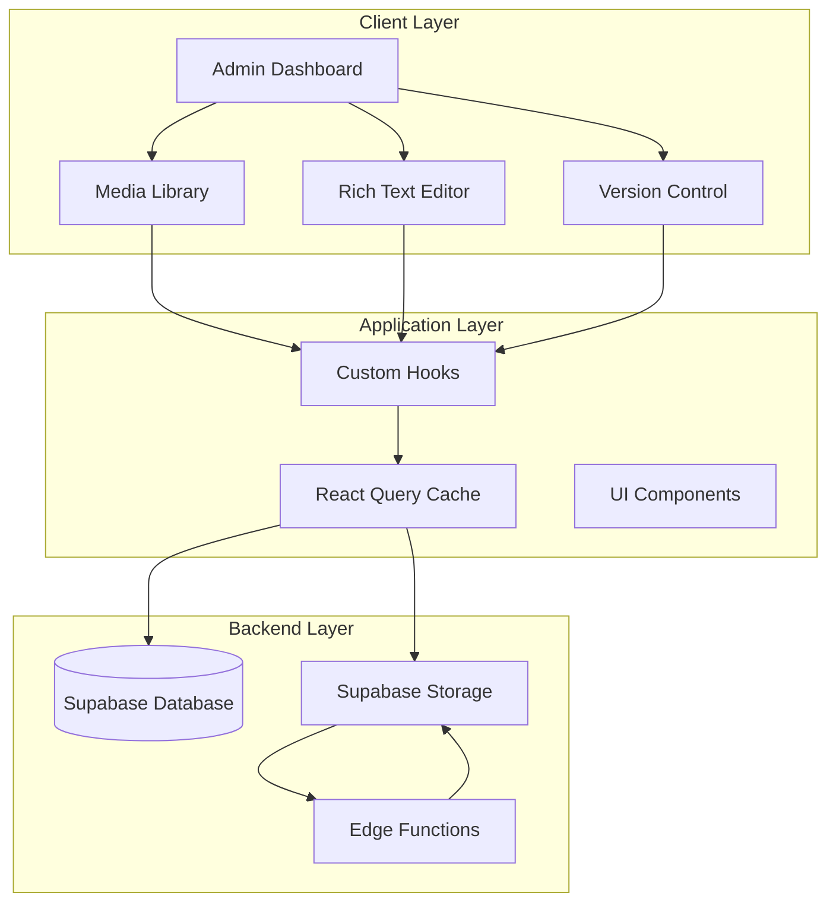
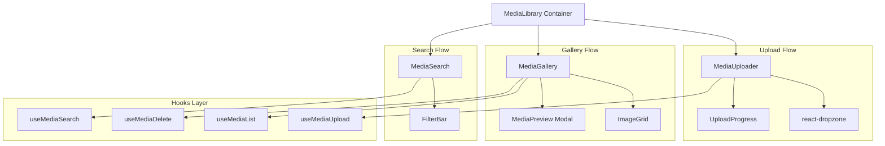
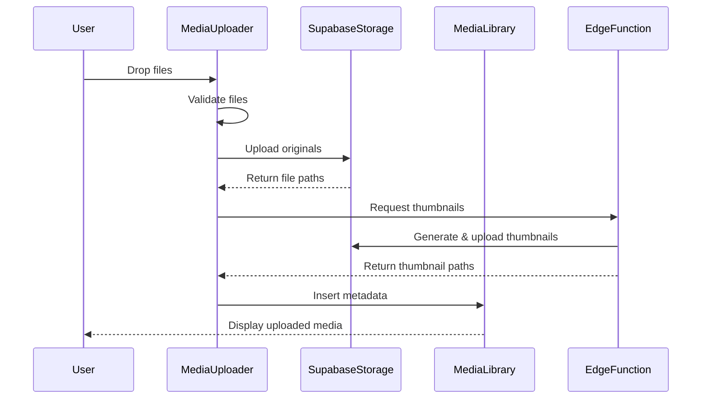
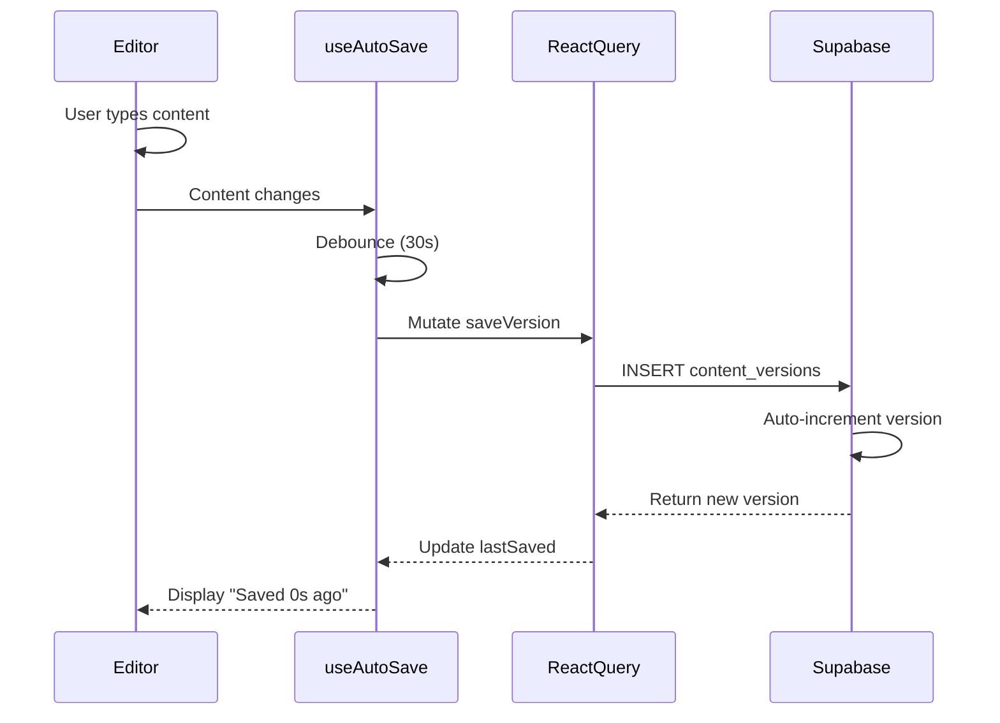

# CMS Phase 5 - System Architecture

> **Version**: 2.1.0
> **Phase**: CMS Phase 5 - Advanced Content Management
> **Status**: Planning
> **Last Updated**: 2025-11-17

## Table of Contents
1. [System Overview](#system-overview)
2. [Component Architecture](#component-architecture)
3. [Data Architecture](#data-architecture)
4. [Integration Architecture](#integration-architecture)
5. [Security Architecture](#security-architecture)
6. [Performance Architecture](#performance-architecture)

---

## 1. System Overview

### 1.1 High-Level Architecture



### 1.2 Module Overview

CMS Phase 5 consists of three core modules:

| Module | Purpose | Key Features | Integration |
|--------|---------|--------------|-------------|
| **Media Library** | Image asset management | Upload, organize, search | Supabase Storage, Admin pages |
| **Rich Text Editor** | Content authoring | Markdown, formatting, media | Tiptap, existing content fields |
| **Version Control** | Content history tracking | Auto-save, diff, restore | Database, all content types |

### 1.3 System Context

CMS Phase 5 extends the existing Admin Dashboard (Phase 4) with advanced content management capabilities:

- **Current State**: Admin CRUD operations use textarea fields for markdown content
- **Target State**: WYSIWYG editor with media library integration and version tracking
- **Migration Path**: Backward compatible - markdown fields remain as fallback

---

## 2. Component Architecture

### 2.1 Media Library Module

#### Component Hierarchy



#### Component Specifications

**MediaLibrary Container** (`src/components/media/MediaLibrary.tsx`)
```typescript
interface MediaLibraryProps {
  mode?: 'select' | 'manage'; // Select for editor, manage for standalone
  onSelect?: (media: MediaItem) => void;
  allowMultiple?: boolean;
  maxFileSize?: number; // Default 10MB
  accept?: string[]; // Default: image/*
}

export const MediaLibrary: React.FC<MediaLibraryProps> = ({
  mode = 'manage',
  onSelect,
  allowMultiple = false,
  maxFileSize = 10 * 1024 * 1024,
  accept = ['image/*']
}) => {
  // State management
  const [view, setView] = useState<'grid' | 'list'>('grid');
  const [selectedItems, setSelectedItems] = useState<MediaItem[]>([]);

  // Layout: Upload area + Gallery + Search/Filter
  return (
    <div className="media-library">
      <MediaUploader maxFileSize={maxFileSize} accept={accept} />
      <MediaSearch />
      <MediaGallery
        view={view}
        onSelect={mode === 'select' ? onSelect : undefined}
      />
    </div>
  );
};
```

**MediaUploader Component** (`src/components/media/MediaUploader.tsx`)
```typescript
interface MediaUploaderProps {
  maxFileSize: number;
  accept: string[];
  onUploadComplete?: (media: MediaItem[]) => void;
}

export const MediaUploader: React.FC<MediaUploaderProps> = ({
  maxFileSize,
  accept,
  onUploadComplete
}) => {
  const { uploadFiles, isUploading, progress } = useMediaUpload();

  const onDrop = useCallback(async (files: File[]) => {
    // Validate files
    const validFiles = files.filter(f =>
      f.size <= maxFileSize && accept.some(type => f.type.match(type))
    );

    // Upload to Supabase Storage
    const uploaded = await uploadFiles(validFiles);
    onUploadComplete?.(uploaded);
  }, [maxFileSize, accept]);

  // react-dropzone integration
  const { getRootProps, getInputProps, isDragActive } = useDropzone({
    onDrop,
    accept: accept.reduce((acc, type) => ({ ...acc, [type]: [] }), {}),
    maxSize: maxFileSize,
    multiple: true
  });

  return (
    <div {...getRootProps()} className="dropzone">
      <input {...getInputProps()} />
      {isDragActive ? <DropIndicator /> : <UploadPrompt />}
      {isUploading && <UploadProgress progress={progress} />}
    </div>
  );
};
```

**MediaGallery Component** (`src/components/media/MediaGallery.tsx`)
```typescript
interface MediaGalleryProps {
  view: 'grid' | 'list';
  onSelect?: (media: MediaItem) => void;
}

export const MediaGallery: React.FC<MediaGalleryProps> = ({ view, onSelect }) => {
  const { data: mediaItems, isLoading } = useMediaList();
  const { deleteMedia } = useMediaDelete();
  const [previewItem, setPreviewItem] = useState<MediaItem | null>(null);

  if (isLoading) return <Skeleton count={12} />;

  return (
    <>
      <div className={view === 'grid' ? 'grid grid-cols-4 gap-4' : 'flex flex-col gap-2'}>
        {mediaItems?.map(item => (
          <MediaCard
            key={item.id}
            item={item}
            view={view}
            onPreview={() => setPreviewItem(item)}
            onSelect={() => onSelect?.(item)}
            onDelete={() => deleteMedia(item.id)}
          />
        ))}
      </div>

      {previewItem && (
        <MediaPreview
          item={previewItem}
          onClose={() => setPreviewItem(null)}
          onSelect={() => onSelect?.(previewItem)}
        />
      )}
    </>
  );
};
```

**MediaSearch Component** (`src/components/media/MediaSearch.tsx`)
```typescript
export const MediaSearch: React.FC = () => {
  const [query, setQuery] = useState('');
  const [filters, setFilters] = useState<MediaFilters>({
    mimeType: null,
    dateRange: null,
    sizeRange: null
  });

  const debouncedQuery = useDebounce(query, 300);
  const { data } = useMediaSearch(debouncedQuery, filters);

  return (
    <div className="media-search">
      <Input
        placeholder="Search images..."
        value={query}
        onChange={e => setQuery(e.target.value)}
      />
      <FilterBar filters={filters} onChange={setFilters} />
    </div>
  );
};
```

### 2.2 Rich Text Editor Module

#### Component Hierarchy

```mermaid
graph TB
    EditorContainer[RichTextEditor Container]

    subgraph "Editor Core"
        TiptapEditor[TiptapEditor]
        EditorContent[Tiptap EditorContent]
    end

    subgraph "Toolbar"
        Toolbar[EditorToolbar]
        MenuBar[EditorMenuBar]
    end

    subgraph "Extensions"
        Bold[Bold Extension]
        Italic[Italic Extension]
        Link[Link Extension]
        Image[Image Extension]
        Code[CodeBlock Extension]
        Markdown[Markdown Extension]
    end

    subgraph "Hooks"
        useEditor[useEditor Hook]
        useMarkdown[useMarkdownSync]
        useImageInsert[useImageInsert]
    end

    EditorContainer --> TiptapEditor
    EditorContainer --> Toolbar
    EditorContainer --> MenuBar

    TiptapEditor --> EditorContent
    TiptapEditor --> Bold
    TiptapEditor --> Italic
    TiptapEditor --> Link
    TiptapEditor --> Image
    TiptapEditor --> Code
    TiptapEditor --> Markdown

    TiptapEditor --> useEditor
    EditorContainer --> useMarkdown
    Image --> useImageInsert
```

#### Component Specifications

**RichTextEditor Container** (`src/components/editor/RichTextEditor.tsx`)
```typescript
interface RichTextEditorProps {
  initialContent?: string; // Markdown or Tiptap JSON
  onUpdate?: (content: { markdown: string; json: JSONContent }) => void;
  placeholder?: string;
  editable?: boolean;
  minHeight?: string;
  maxHeight?: string;
}

export const RichTextEditor: React.FC<RichTextEditorProps> = ({
  initialContent = '',
  onUpdate,
  placeholder = 'Start writing...',
  editable = true,
  minHeight = '200px',
  maxHeight = '600px'
}) => {
  const { editor } = useEditor({
    content: initialContent,
    onUpdate: ({ editor }) => {
      const json = editor.getJSON();
      const markdown = editor.storage.markdown.getMarkdown();
      onUpdate?.({ markdown, json });
    },
    editable,
    extensions: [
      StarterKit,
      Image.configure({
        inline: true,
        allowBase64: true
      }),
      CodeBlockLowlight.configure({
        lowlight
      }),
      Markdown.configure({
        html: true,
        tightLists: true
      })
    ]
  });

  if (!editor) return <Skeleton height={minHeight} />;

  return (
    <div className="rich-text-editor" style={{ minHeight, maxHeight }}>
      <EditorToolbar editor={editor} />
      <EditorMenuBar editor={editor} />
      <EditorContent editor={editor} className="prose prose-sm" />
    </div>
  );
};
```

**EditorToolbar Component** (`src/components/editor/EditorToolbar.tsx`)
```typescript
interface EditorToolbarProps {
  editor: Editor;
}

export const EditorToolbar: React.FC<EditorToolbarProps> = ({ editor }) => {
  return (
    <div className="editor-toolbar flex gap-1 p-2 border-b">
      {/* Text formatting */}
      <ToolbarButton
        onClick={() => editor.chain().focus().toggleBold().run()}
        active={editor.isActive('bold')}
        icon={<Bold />}
        tooltip="Bold (Cmd+B)"
      />
      <ToolbarButton
        onClick={() => editor.chain().focus().toggleItalic().run()}
        active={editor.isActive('italic')}
        icon={<Italic />}
        tooltip="Italic (Cmd+I)"
      />

      {/* Headings */}
      <ToolbarDropdown
        label="Heading"
        options={[
          { label: 'H1', onClick: () => editor.chain().focus().toggleHeading({ level: 1 }).run() },
          { label: 'H2', onClick: () => editor.chain().focus().toggleHeading({ level: 2 }).run() },
          { label: 'H3', onClick: () => editor.chain().focus().toggleHeading({ level: 3 }).run() }
        ]}
      />

      {/* Lists */}
      <ToolbarButton
        onClick={() => editor.chain().focus().toggleBulletList().run()}
        active={editor.isActive('bulletList')}
        icon={<List />}
        tooltip="Bullet List"
      />

      {/* Link */}
      <LinkButton editor={editor} />
    </div>
  );
};
```

**EditorMenuBar Component** (`src/components/editor/EditorMenuBar.tsx`)
```typescript
export const EditorMenuBar: React.FC<{ editor: Editor }> = ({ editor }) => {
  const { insertImage } = useImageInsert(editor);

  return (
    <div className="editor-menu-bar flex gap-2 p-2 bg-muted">
      {/* Image insertion */}
      <Button
        variant="ghost"
        size="sm"
        onClick={() => {
          // Open media library modal
          openMediaLibrary({
            mode: 'select',
            onSelect: (media) => insertImage(media.file_path, media.alt_text)
          });
        }}
      >
        <ImageIcon className="w-4 h-4 mr-2" />
        Insert Image
      </Button>

      {/* Code block */}
      <Button
        variant="ghost"
        size="sm"
        onClick={() => editor.chain().focus().toggleCodeBlock().run()}
      >
        <Code className="w-4 h-4 mr-2" />
        Code Block
      </Button>

      {/* View markdown */}
      <MarkdownPreviewToggle editor={editor} />
    </div>
  );
};
```

**Image Extension** (`src/components/editor/extensions/ImageExtension.ts`)
```typescript
import { Node } from '@tiptap/core';
import { ReactNodeViewRenderer } from '@tiptap/react';
import ImageNodeView from './ImageNodeView';

export const ImageExtension = Node.create({
  name: 'customImage',

  group: 'block',

  draggable: true,

  addAttributes() {
    return {
      src: { default: null },
      alt: { default: null },
      title: { default: null },
      width: { default: null },
      height: { default: null }
    };
  },

  parseHTML() {
    return [{ tag: 'img[src]' }];
  },

  renderHTML({ HTMLAttributes }) {
    return ['img', HTMLAttributes];
  },

  addNodeView() {
    return ReactNodeViewRenderer(ImageNodeView);
  },

  addCommands() {
    return {
      setImage: (options) => ({ commands }) => {
        return commands.insertContent({
          type: this.name,
          attrs: options
        });
      }
    };
  }
});
```

**useImageInsert Hook** (`src/components/editor/hooks/useImageInsert.ts`)
```typescript
export const useImageInsert = (editor: Editor) => {
  const insertImage = useCallback(
    (src: string, alt?: string, title?: string) => {
      if (!src) return;

      editor
        .chain()
        .focus()
        .setImage({ src, alt, title })
        .run();
    },
    [editor]
  );

  const insertImageFromFile = useCallback(
    async (file: File) => {
      // Upload to media library first
      const { uploadFiles } = useMediaUpload();
      const [uploaded] = await uploadFiles([file]);

      if (uploaded) {
        insertImage(uploaded.file_path, uploaded.alt_text);
      }
    },
    [insertImage]
  );

  return { insertImage, insertImageFromFile };
};
```

### 2.3 Version Control Module

#### Component Hierarchy

```mermaid
graph TB
    VersionControl[VersionControl Container]

    subgraph "Auto-Save"
        AutoSave[AutoSave Indicator]
        SaveStatus[SaveStatus Display]
    end

    subgraph "History"
        History[VersionHistory]
        Timeline[VersionTimeline]
        ListItem[VersionListItem]
    end

    subgraph "Compare"
        Compare[VersionCompare]
        DiffView[DiffViewer]
    end

    subgraph "Restore"
        Restore[VersionRestore]
        ConfirmDialog[RestoreConfirmDialog]
    end

    subgraph "Hooks"
        useAutoSave[useAutoSave]
        useHistory[useVersionHistory]
        useRestore[useVersionRestore]
    end

    VersionControl --> AutoSave
    VersionControl --> History

    AutoSave --> SaveStatus
    AutoSave --> useAutoSave

    History --> Timeline
    Timeline --> ListItem
    History --> useHistory

    ListItem --> Compare
    Compare --> DiffView

    ListItem --> Restore
    Restore --> ConfirmDialog
    Restore --> useRestore
```

#### Component Specifications

**VersionControl Container** (`src/components/version/VersionControl.tsx`)
```typescript
interface VersionControlProps {
  contentType: 'project' | 'lab' | 'blog' | 'service';
  contentId: string;
  currentContent: JSONContent;
  onRestore?: (version: ContentVersion) => void;
}

export const VersionControl: React.FC<VersionControlProps> = ({
  contentType,
  contentId,
  currentContent,
  onRestore
}) => {
  const [showHistory, setShowHistory] = useState(false);
  const { lastSaved, isSaving } = useAutoSave({
    contentType,
    contentId,
    content: currentContent,
    interval: 30000 // 30 seconds
  });

  return (
    <div className="version-control">
      <AutoSave lastSaved={lastSaved} isSaving={isSaving} />

      <Button
        variant="ghost"
        onClick={() => setShowHistory(true)}
      >
        <History className="w-4 h-4 mr-2" />
        View History
      </Button>

      {showHistory && (
        <VersionHistory
          contentType={contentType}
          contentId={contentId}
          currentContent={currentContent}
          onRestore={onRestore}
          onClose={() => setShowHistory(false)}
        />
      )}
    </div>
  );
};
```

**AutoSave Component** (`src/components/version/AutoSave.tsx`)
```typescript
interface AutoSaveProps {
  lastSaved: Date | null;
  isSaving: boolean;
}

export const AutoSave: React.FC<AutoSaveProps> = ({ lastSaved, isSaving }) => {
  return (
    <div className="auto-save flex items-center gap-2 text-sm text-muted-foreground">
      {isSaving ? (
        <>
          <Loader2 className="w-4 h-4 animate-spin" />
          <span>Saving...</span>
        </>
      ) : lastSaved ? (
        <>
          <Check className="w-4 h-4 text-green-600" />
          <span>Saved {formatDistanceToNow(lastSaved)} ago</span>
        </>
      ) : (
        <span>Not saved</span>
      )}
    </div>
  );
};
```

**VersionHistory Component** (`src/components/version/VersionHistory.tsx`)
```typescript
interface VersionHistoryProps {
  contentType: string;
  contentId: string;
  currentContent: JSONContent;
  onRestore?: (version: ContentVersion) => void;
  onClose: () => void;
}

export const VersionHistory: React.FC<VersionHistoryProps> = ({
  contentType,
  contentId,
  currentContent,
  onRestore,
  onClose
}) => {
  const { data: versions, isLoading } = useVersionHistory(contentType, contentId);
  const [compareVersion, setCompareVersion] = useState<ContentVersion | null>(null);
  const [restoreVersion, setRestoreVersion] = useState<ContentVersion | null>(null);

  return (
    <Dialog open onOpenChange={onClose}>
      <DialogContent className="max-w-4xl max-h-[80vh]">
        <DialogHeader>
          <DialogTitle>Version History</DialogTitle>
        </DialogHeader>

        <div className="grid grid-cols-2 gap-4">
          {/* Version list */}
          <div className="version-list space-y-2 overflow-y-auto max-h-[60vh]">
            {versions?.map(version => (
              <VersionListItem
                key={version.id}
                version={version}
                onCompare={() => setCompareVersion(version)}
                onRestore={() => setRestoreVersion(version)}
              />
            ))}
          </div>

          {/* Comparison view */}
          <div className="version-compare">
            {compareVersion ? (
              <VersionCompare
                current={currentContent}
                previous={compareVersion.content}
              />
            ) : (
              <div className="text-center text-muted-foreground">
                Select a version to compare
              </div>
            )}
          </div>
        </div>

        {restoreVersion && (
          <VersionRestore
            version={restoreVersion}
            onConfirm={() => {
              onRestore?.(restoreVersion);
              setRestoreVersion(null);
            }}
            onCancel={() => setRestoreVersion(null)}
          />
        )}
      </DialogContent>
    </Dialog>
  );
};
```

**VersionCompare Component** (`src/components/version/VersionCompare.tsx`)
```typescript
import * as Diff from 'diff';

interface VersionCompareProps {
  current: JSONContent;
  previous: JSONContent;
}

export const VersionCompare: React.FC<VersionCompareProps> = ({
  current,
  previous
}) => {
  // Convert JSON to markdown for comparison
  const currentMarkdown = jsonToMarkdown(current);
  const previousMarkdown = jsonToMarkdown(previous);

  // Generate diff
  const diff = Diff.diffLines(previousMarkdown, currentMarkdown);

  return (
    <div className="version-compare">
      <h3 className="font-semibold mb-4">Changes</h3>
      <div className="diff-view space-y-1 font-mono text-sm">
        {diff.map((part, index) => (
          <div
            key={index}
            className={cn(
              'p-2',
              part.added && 'bg-green-100 dark:bg-green-900',
              part.removed && 'bg-red-100 dark:bg-red-900'
            )}
          >
            {part.added && '+ '}
            {part.removed && '- '}
            {part.value}
          </div>
        ))}
      </div>
    </div>
  );
};
```

**useAutoSave Hook** (`src/hooks/useAutoSave.ts`)
```typescript
interface UseAutoSaveOptions {
  contentType: string;
  contentId: string;
  content: JSONContent;
  interval?: number; // milliseconds, default 30000
}

export const useAutoSave = ({
  contentType,
  contentId,
  content,
  interval = 30000
}: UseAutoSaveOptions) => {
  const [lastSaved, setLastSaved] = useState<Date | null>(null);
  const [isSaving, setIsSaving] = useState(false);

  const debouncedContent = useDebounce(content, interval);

  const { mutate: saveVersion } = useMutation({
    mutationFn: async (content: JSONContent) => {
      const markdown = jsonToMarkdown(content);

      const { data, error } = await supabase
        .from('content_versions')
        .insert({
          content_type: contentType,
          content_id: contentId,
          content,
          markdown,
          changed_by: (await supabase.auth.getUser()).data.user?.id
        })
        .select()
        .single();

      if (error) throw error;
      return data;
    },
    onMutate: () => setIsSaving(true),
    onSuccess: () => {
      setLastSaved(new Date());
      setIsSaving(false);
    },
    onError: () => setIsSaving(false)
  });

  useEffect(() => {
    if (debouncedContent && contentId) {
      saveVersion(debouncedContent);
    }
  }, [debouncedContent, contentId]);

  return { lastSaved, isSaving };
};
```

---

## 3. Data Architecture

### 3.1 Supabase Storage Structure

```
Storage Buckets:
├── media/ (Public bucket with RLS)
│   └── {user_id}/
│       ├── originals/
│       │   └── {timestamp}_{filename}.{ext}
│       └── thumbnails/
│           └── {timestamp}_{filename}_thumb.webp
```

**Bucket Configuration**:
```sql
-- Create media bucket
INSERT INTO storage.buckets (id, name, public)
VALUES ('media', 'media', true);

-- RLS Policy: Users can upload their own files
CREATE POLICY "Users can upload own files"
ON storage.objects FOR INSERT
TO authenticated
WITH CHECK (
  bucket_id = 'media' AND
  (storage.foldername(name))[1] = auth.uid()::text
);

-- RLS Policy: Anyone can view files
CREATE POLICY "Anyone can view files"
ON storage.objects FOR SELECT
TO public
USING (bucket_id = 'media');

-- RLS Policy: Users can delete own files
CREATE POLICY "Users can delete own files"
ON storage.objects FOR DELETE
TO authenticated
USING (
  bucket_id = 'media' AND
  (storage.foldername(name))[1] = auth.uid()::text
);
```

### 3.2 Database Schema

**Media Library Table** (`media_library`)

```sql
CREATE TABLE media_library (
  id UUID PRIMARY KEY DEFAULT uuid_generate_v4(),
  user_id UUID REFERENCES auth.users(id) ON DELETE CASCADE NOT NULL,
  filename TEXT NOT NULL,
  file_path TEXT NOT NULL UNIQUE,
  file_size INTEGER NOT NULL CHECK (file_size > 0 AND file_size <= 10485760), -- 10MB max
  mime_type TEXT NOT NULL CHECK (mime_type LIKE 'image/%'),
  thumbnail_path TEXT,
  alt_text TEXT,
  width INTEGER,
  height INTEGER,
  created_at TIMESTAMPTZ DEFAULT NOW() NOT NULL,
  updated_at TIMESTAMPTZ DEFAULT NOW() NOT NULL
);

-- Indexes
CREATE INDEX idx_media_user ON media_library(user_id);
CREATE INDEX idx_media_created ON media_library(created_at DESC);
CREATE INDEX idx_media_filename ON media_library USING GIN (to_tsvector('english', filename));

-- RLS Policies
ALTER TABLE media_library ENABLE ROW LEVEL SECURITY;

CREATE POLICY "Users can view all media"
ON media_library FOR SELECT
TO authenticated
USING (true);

CREATE POLICY "Users can insert own media"
ON media_library FOR INSERT
TO authenticated
WITH CHECK (auth.uid() = user_id);

CREATE POLICY "Users can update own media"
ON media_library FOR UPDATE
TO authenticated
USING (auth.uid() = user_id);

CREATE POLICY "Users can delete own media"
ON media_library FOR DELETE
TO authenticated
USING (auth.uid() = user_id);

-- Trigger: Update updated_at
CREATE TRIGGER update_media_library_updated_at
BEFORE UPDATE ON media_library
FOR EACH ROW
EXECUTE FUNCTION update_updated_at_column();
```

**Content Versions Table** (`content_versions`)

```sql
CREATE TABLE content_versions (
  id UUID PRIMARY KEY DEFAULT uuid_generate_v4(),
  content_type TEXT NOT NULL CHECK (content_type IN ('project', 'lab', 'blog', 'service')),
  content_id UUID NOT NULL,
  version INTEGER NOT NULL,
  title TEXT,
  content JSONB NOT NULL,
  markdown TEXT,
  changed_by UUID REFERENCES auth.users(id) ON DELETE SET NULL,
  created_at TIMESTAMPTZ DEFAULT NOW() NOT NULL
);

-- Indexes
CREATE INDEX idx_versions_content ON content_versions(content_type, content_id);
CREATE INDEX idx_versions_created ON content_versions(created_at DESC);
CREATE UNIQUE INDEX idx_versions_number ON content_versions(content_type, content_id, version);

-- RLS Policies
ALTER TABLE content_versions ENABLE ROW LEVEL SECURITY;

CREATE POLICY "Anyone can view versions"
ON content_versions FOR SELECT
TO authenticated
USING (true);

CREATE POLICY "Authenticated users can create versions"
ON content_versions FOR INSERT
TO authenticated
WITH CHECK (auth.uid() = changed_by);

-- Trigger: Auto-increment version number
CREATE OR REPLACE FUNCTION increment_version_number()
RETURNS TRIGGER AS $$
BEGIN
  NEW.version := COALESCE(
    (SELECT MAX(version) + 1
     FROM content_versions
     WHERE content_type = NEW.content_type
     AND content_id = NEW.content_id),
    1
  );
  RETURN NEW;
END;
$$ LANGUAGE plpgsql;

CREATE TRIGGER auto_increment_version
BEFORE INSERT ON content_versions
FOR EACH ROW
EXECUTE FUNCTION increment_version_number();
```

### 3.3 Data Flow Diagrams

**Media Upload Flow**:


**Version Auto-Save Flow**:


---

## 4. Integration Architecture

### 4.1 Admin Dashboard Integration

**Current Admin Pages** → **Phase 5 Integration**:

| Page | Current Field | Phase 5 Component | Migration |
|------|--------------|-------------------|-----------|
| AdminPortfolio | `description` (textarea) | RichTextEditor | Add `description_json` column |
| AdminLab | `description` (textarea) | RichTextEditor | Add `description_json` column |
| AdminBlog | `content` (textarea) | RichTextEditor | Add `content_json` column |
| AdminServices | `description` (textarea) | RichTextEditor | Add `description_json` column |

**Integration Pattern**:
```typescript
// Before (Phase 4)
<Textarea
  value={description}
  onChange={(e) => setDescription(e.target.value)}
/>

// After (Phase 5)
<RichTextEditor
  initialContent={description_json || description} // Fallback to markdown
  onUpdate={({ markdown, json }) => {
    setDescription(markdown); // Keep markdown for compatibility
    setDescriptionJson(json); // Store Tiptap JSON
  }}
/>
```

### 4.2 React Query Integration

**Cache Strategy**:
```typescript
// Media Library Cache
queryClient.setQueryDefaults(['media'], {
  staleTime: 5 * 60 * 1000, // 5 minutes
  cacheTime: 10 * 60 * 1000, // 10 minutes
  refetchOnWindowFocus: false
});

// Version History Cache
queryClient.setQueryDefaults(['versions'], {
  staleTime: 1 * 60 * 1000, // 1 minute
  cacheTime: 5 * 60 * 1000, // 5 minutes
  refetchOnMount: true
});
```

**Optimistic Updates**:
```typescript
const { mutate: uploadMedia } = useMutation({
  mutationFn: uploadFiles,
  onMutate: async (files) => {
    // Cancel outgoing refetches
    await queryClient.cancelQueries(['media']);

    // Snapshot previous value
    const previous = queryClient.getQueryData(['media']);

    // Optimistically update
    queryClient.setQueryData(['media'], (old: MediaItem[]) => [
      ...old,
      ...files.map(f => ({ id: 'temp', filename: f.name, status: 'uploading' }))
    ]);

    return { previous };
  },
  onError: (err, vars, context) => {
    // Rollback on error
    queryClient.setQueryData(['media'], context.previous);
  },
  onSettled: () => {
    // Refetch to ensure consistency
    queryClient.invalidateQueries(['media']);
  }
});
```

### 4.3 Supabase Integration

**Realtime Subscriptions** (Optional for collaborative editing):
```typescript
useEffect(() => {
  const channel = supabase
    .channel('content-changes')
    .on(
      'postgres_changes',
      {
        event: 'INSERT',
        schema: 'public',
        table: 'content_versions',
        filter: `content_id=eq.${contentId}`
      },
      (payload) => {
        // Notify user of new version
        toast.info('New version saved by another user');
        queryClient.invalidateQueries(['versions', contentId]);
      }
    )
    .subscribe();

  return () => {
    supabase.removeChannel(channel);
  };
}, [contentId]);
```

---

## 5. Security Architecture

### 5.1 Authentication & Authorization

**Role-Based Access**:
- **Admin Users**: Full access to media library and version control
- **Regular Users**: Read-only access to public media
- **Anonymous**: No access to admin features

**RLS Enforcement**:
```sql
-- Example: Media library access
CREATE POLICY "Admin access all media"
ON media_library FOR ALL
TO authenticated
USING (
  EXISTS (
    SELECT 1 FROM admins
    WHERE admins.user_id = auth.uid()
  )
);
```

### 5.2 Content Security

**XSS Prevention**:
```typescript
import DOMPurify from 'dompurify';

// Sanitize HTML before rendering
const SafeContent = ({ html }: { html: string }) => {
  const sanitized = DOMPurify.sanitize(html, {
    ALLOWED_TAGS: ['p', 'strong', 'em', 'a', 'img', 'h1', 'h2', 'h3', 'ul', 'ol', 'li', 'code', 'pre'],
    ALLOWED_ATTR: ['href', 'src', 'alt', 'title', 'class']
  });

  return <div dangerouslySetInnerHTML={{ __html: sanitized }} />;
};
```

**File Upload Security**:
```typescript
const ALLOWED_MIME_TYPES = [
  'image/jpeg',
  'image/png',
  'image/gif',
  'image/webp',
  'image/svg+xml'
];

const MAX_FILE_SIZE = 10 * 1024 * 1024; // 10MB

const validateFile = (file: File): boolean => {
  if (!ALLOWED_MIME_TYPES.includes(file.type)) {
    throw new Error('Invalid file type');
  }

  if (file.size > MAX_FILE_SIZE) {
    throw new Error('File too large');
  }

  return true;
};
```

### 5.3 API Security

**Rate Limiting** (Supabase Edge Function):
```typescript
// Image optimization function
import { serve } from 'https://deno.land/std@0.168.0/http/server.ts';
import sharp from 'sharp';

const rateLimiter = new Map<string, number>();

serve(async (req) => {
  const userId = req.headers.get('x-user-id');

  // Rate limit: 100 requests per hour
  const count = rateLimiter.get(userId) || 0;
  if (count > 100) {
    return new Response('Rate limit exceeded', { status: 429 });
  }

  rateLimiter.set(userId, count + 1);

  // Process image...
});
```

---

## 6. Performance Architecture

### 6.1 Code Splitting Strategy

```typescript
// Lazy load editor components
const RichTextEditor = lazy(() => import('@/components/editor/RichTextEditor'));
const MediaLibrary = lazy(() => import('@/components/media/MediaLibrary'));
const VersionHistory = lazy(() => import('@/components/version/VersionHistory'));

// Use in admin pages
const AdminPortfolio = () => {
  const [showEditor, setShowEditor] = useState(false);

  return (
    <div>
      {showEditor ? (
        <Suspense fallback={<EditorSkeleton />}>
          <RichTextEditor />
        </Suspense>
      ) : (
        <Button onClick={() => setShowEditor(true)}>Edit Content</Button>
      )}
    </div>
  );
};
```

### 6.2 Image Optimization

**Thumbnail Generation** (Supabase Edge Function):
```typescript
import { serve } from 'https://deno.land/std@0.168.0/http/server.ts';
import { createClient } from 'https://esm.sh/@supabase/supabase-js@2';
import sharp from 'sharp';

serve(async (req) => {
  const { filePath } = await req.json();

  // Download original
  const { data: original } = await supabase.storage
    .from('media')
    .download(filePath);

  // Generate thumbnail (200x200, WebP)
  const thumbnail = await sharp(original)
    .resize(200, 200, { fit: 'cover' })
    .webp({ quality: 80 })
    .toBuffer();

  // Upload thumbnail
  const thumbPath = filePath.replace(/\.(jpg|png)$/, '_thumb.webp');
  await supabase.storage
    .from('media')
    .upload(thumbPath, thumbnail, {
      contentType: 'image/webp',
      cacheControl: '31536000' // 1 year
    });

  return new Response(JSON.stringify({ thumbPath }));
});
```

### 6.3 Caching Strategy

**CDN Configuration** (Vercel):
```json
{
  "headers": [
    {
      "source": "/media/:path*",
      "headers": [
        {
          "key": "Cache-Control",
          "value": "public, max-age=31536000, immutable"
        }
      ]
    }
  ]
}
```

**Browser Cache** (React Query):
```typescript
const queryClient = new QueryClient({
  defaultOptions: {
    queries: {
      staleTime: 5 * 60 * 1000,
      cacheTime: 10 * 60 * 1000,
      retry: 1,
      refetchOnWindowFocus: false
    }
  }
});
```

---

## Appendix

### A. Technology Versions
- Tiptap: ^2.1.0
- react-dropzone: ^14.2.0
- sharp: ^0.33.0 (Edge Function)
- DOMPurify: ^3.0.0
- diff-match-patch: ^1.0.5

### B. Bundle Size Estimates
- Tiptap (core + extensions): ~50 kB gzip
- react-dropzone: ~15 kB gzip
- DOMPurify: ~20 kB gzip
- diff-match-patch: ~10 kB gzip
- **Total**: ~95 kB gzip

### C. Migration Checklist
- [ ] Create Supabase Storage bucket
- [ ] Run database migrations
- [ ] Deploy Edge Function
- [ ] Add JSON columns to existing tables
- [ ] Update Admin pages
- [ ] Test backward compatibility
- [ ] Update E2E tests

---

**Document Status**: ✅ Complete
**Next Steps**: Review tech-stack.md and implementation-strategy.md
